# 資料庫 Table 設計與 ERD

## 1. 設計目標

本資料庫設計支援 AI 運動訓練與飲食紀錄系統的第一版 MVP，重點包含：

1. 使用者基本資料與訓練目標。
2. AI 產生訓練計畫與每日營養建議。
3. 訓練計畫版本管理。
4. 每日運動與飲食紀錄。
5. AI 分析回饋。
6. AI 重新調整計畫紀錄。

資料庫目前使用 SQLite，並透過 Prisma ORM 管理 schema、relation 與 migration。

## 2. Entity Relationship Diagram

```mermaid
erDiagram
  UserProfile ||--o{ TrainingGoal : has
  UserProfile ||--o{ TrainingPlan : owns
  UserProfile ||--o{ WorkoutLog : writes
  UserProfile ||--o{ FoodLog : writes
  UserProfile ||--o{ AiFeedback : receives
  UserProfile ||--o{ TrainingPlanConversation : starts

  TrainingGoal ||--o{ TrainingPlan : creates
  TrainingGoal ||--o{ TrainingPlanConversation : provides_context

  TrainingPlan ||--o{ TrainingPlanVersion : has
  TrainingPlanVersion ||--o{ TrainingDay : contains
  TrainingDay ||--o| NutritionSuggestion : has
  TrainingDay ||--o{ WorkoutLog : compared_with
  TrainingDay ||--o{ FoodLog : related_to

  WorkoutLog ||--o{ FoodLog : same_day_context
  WorkoutLog ||--o{ AiFeedback : analyzed_by
  FoodLog ||--o{ AiFeedback : analyzed_by

  TrainingPlanVersion ||--o{ PlanAdjustment : adjusted_by
  TrainingPlanVersion ||--o| TrainingPlanConversation : generated_from
  PlanAdjustment ||--o| TrainingPlanVersion : creates_new_version
  PlanAdjustment ||--o{ AiFeedback : referenced_by
  TrainingPlanConversation ||--o{ TrainingPlanConversationMessage : contains

  UserProfile {
    string id PK
    string name
    int age
    string gender
    float heightCm
    float weightKg
    string dietaryRestrictions
    datetime createdAt
    datetime updatedAt
  }

  TrainingGoal {
    string id PK
    string userProfileId FK
    string raceName
    string targetDistance
    datetime raceDate
    string targetFinishTime
    string goalType
    float currentWeeklyMileageKm
    string recentFiveKTime
    string recentTenKTime
    string recentHalfMarathonTime
    boolean hasMarathonExperience
    int weeklyTrainingDays
    string preferredTrainingDays
    string unavailableDates
    string injuryNote
    string fatigueLevel
    datetime createdAt
    datetime updatedAt
  }

  TrainingPlan {
    string id PK
    string userProfileId FK
    string trainingGoalId FK
    string title
    string status
    datetime startDate
    datetime endDate
    string activeVersionId
    datetime createdAt
    datetime updatedAt
  }

  TrainingPlanVersion {
    string id PK
    string trainingPlanId FK
    int versionNumber
    string status
    string summary
    string aiModel
    string promptSnapshot
    datetime createdAt
    datetime confirmedAt
  }

  TrainingPlanConversation {
    string id PK
    string userProfileId FK
    string trainingGoalId FK
    string trainingPlanId
    string conversationType
    string generatedTrainingPlanVersionId FK
    string status
    string summary
    string readiness
    string riskLevel
    datetime createdAt
    datetime updatedAt
  }

  TrainingPlanConversationMessage {
    string id PK
    string conversationId FK
    string role
    string content
    string metadataJson
    datetime createdAt
  }

  TrainingDay {
    string id PK
    string trainingPlanVersionId FK
    datetime date
    string trainingType
    float targetDistanceKm
    int targetDurationMin
    string targetPace
    string targetIntensity
    string description
    string notes
    string recoverySuggestion
    string completionStatus
    datetime createdAt
    datetime updatedAt
  }

  NutritionSuggestion {
    string id PK
    string trainingDayId FK
    string carbSuggestion
    string proteinSuggestion
    string hydrationSuggestion
    string preWorkoutSuggestion
    string postWorkoutSuggestion
    string longRunFuelSuggestion
    string restDaySuggestion
    string estimateNote
    datetime createdAt
    datetime updatedAt
  }

  WorkoutLog {
    string id PK
    string userProfileId FK
    string trainingDayId FK
    datetime logDate
    string rawInput
    string workoutType
    float distanceKm
    int durationMin
    string pace
    int heartRateAvg
    int fatigueScore
    string painLocation
    int painScore
    string completionStatus
    string parsedByModel
    datetime createdAt
    datetime updatedAt
  }

  FoodLog {
    string id PK
    string userProfileId FK
    string trainingDayId FK
    string workoutLogId FK
    datetime logDate
    string rawInput
    string mealType
    string foodItemsJson
    float estimatedCarbsG
    float estimatedProteinG
    float estimatedCalories
    string estimateNote
    string parsedByModel
    datetime createdAt
    datetime updatedAt
  }

  AiFeedback {
    string id PK
    string userProfileId FK
    string workoutLogId FK
    string foodLogId FK
    string planAdjustmentId FK
    string feedbackType
    string summary
    string trainingAnalysis
    string nutritionAnalysis
    string riskWarning
    string nextStepSuggestion
    boolean shouldReplan
    string aiModel
    string promptSnapshot
    datetime createdAt
  }

  PlanAdjustment {
    string id PK
    string trainingPlanVersionId FK
    string newTrainingPlanVersionId FK
    string reasonType
    string reasonDescription
    string affectedDates
    string beforeSummary
    string afterSummary
    string status
    string aiModel
    string promptSnapshot
    datetime createdAt
    datetime confirmedAt
  }
```

## 3. Table 說明

## 3.1 UserProfile

儲存使用者基本資料與飲食限制。

| 欄位 | 型別 | 說明 |
| --- | --- | --- |
| id | String | Primary key |
| name | String | 使用者名稱 |
| age | Int | 年齡 |
| gender | String | 性別 |
| heightCm | Float | 身高，單位公分 |
| weightKg | Float | 體重，單位公斤 |
| dietaryRestrictions | String | 飲食限制，例如素食、過敏、忌口 |
| createdAt | DateTime | 建立時間 |
| updatedAt | DateTime | 更新時間 |

## 3.2 TrainingGoal

儲存使用者的訓練目標、目前能力、可訓練時間與身體狀況。

| 欄位 | 型別 | 說明 |
| --- | --- | --- |
| id | String | Primary key |
| userProfileId | String | 關聯 UserProfile |
| raceName | String | 目標賽事名稱 |
| targetDistance | String | 目標距離，例如 5K、10K、Half Marathon、Marathon |
| raceDate | DateTime | 比賽日期 |
| targetFinishTime | String | 目標完賽時間 |
| goalType | String | 完賽、破 PB、指定成績 |
| currentWeeklyMileageKm | Float | 目前每週跑量 |
| recentFiveKTime | String | 最近 5K 成績 |
| recentTenKTime | String | 最近 10K 成績 |
| recentHalfMarathonTime | String | 最近半馬成績 |
| hasMarathonExperience | Boolean | 是否有全馬經驗 |
| weeklyTrainingDays | Int | 每週可訓練天數 |
| preferredTrainingDays | String | 偏好訓練日，可用 JSON 字串儲存 |
| unavailableDates | String | 不方便訓練日期，可用 JSON 字串儲存 |
| injuryNote | String | 傷痛描述 |
| fatigueLevel | String | 疲勞狀況 |
| createdAt | DateTime | 建立時間 |
| updatedAt | DateTime | 更新時間 |

## 3.3 TrainingPlan

訓練計畫主檔。一個計畫可以有多個版本。

| 欄位 | 型別 | 說明 |
| --- | --- | --- |
| id | String | Primary key |
| userProfileId | String | 關聯 UserProfile |
| trainingGoalId | String | 關聯 TrainingGoal |
| title | String | 計畫名稱 |
| status | String | draft、active、archived |
| startDate | DateTime | 計畫開始日期 |
| endDate | DateTime | 計畫結束日期 |
| activeVersionId | String | 目前套用中的 TrainingPlanVersion |
| createdAt | DateTime | 建立時間 |
| updatedAt | DateTime | 更新時間 |

## 3.4 TrainingPlanVersion

訓練計畫版本。AI 初次產生或重新調整計畫時，都應建立版本。

| 欄位 | 型別 | 說明 |
| --- | --- | --- |
| id | String | Primary key |
| trainingPlanId | String | 關聯 TrainingPlan |
| versionNumber | Int | 版本號 |
| status | String | draft、confirmed、rejected、archived |
| summary | String | 版本摘要 |
| aiModel | String | 產生此版本使用的 OpenAI model |
| promptSnapshot | String | 產生此版本時使用的 prompt 快照 |
| createdAt | DateTime | 建立時間 |
| confirmedAt | DateTime | 使用者確認時間 |

## 3.5 TrainingDay

每日訓練內容。

| 欄位 | 型別 | 說明 |
| --- | --- | --- |
| id | String | Primary key |
| trainingPlanVersionId | String | 關聯 TrainingPlanVersion |
| date | DateTime | 訓練日期 |
| trainingType | String | easy、long_run、tempo、interval、rest、cross_training |
| targetDistanceKm | Float | 目標距離 |
| targetDurationMin | Int | 目標時間 |
| targetPace | String | 目標配速 |
| targetIntensity | String | 目標強度 |
| description | String | 訓練說明 |
| notes | String | 注意事項 |
| recoverySuggestion | String | 恢復建議 |
| completionStatus | String | planned、completed、partial、missed、changed、rest |
| createdAt | DateTime | 建立時間 |
| updatedAt | DateTime | 更新時間 |

## 3.6 TrainingPlanConversation

儲存 AI 訓練規劃或計畫調整對話的狀態、資訊完整度與風險層級。規劃對話可關聯訓練目標，調整對話則記錄所屬訓練計畫；產生草稿後再關聯唯一一筆 TrainingPlanVersion。

| 欄位 | 型別 | 說明 |
| --- | --- | --- |
| id | String | Primary key |
| userProfileId | String | 關聯 UserProfile |
| trainingGoalId | String | 可選，關聯 TrainingGoal |
| trainingPlanId | String | 可選，計畫調整對話所屬的 TrainingPlan |
| conversationType | String | planning、adjustment，預設 planning |
| generatedTrainingPlanVersionId | String | 可選且唯一，關聯此對話產生的 TrainingPlanVersion |
| status | String | active、completed、archived，預設 active |
| summary | String | 對話摘要與已蒐集資訊 |
| readiness | String | needs_more_info、ready_to_generate、high_risk，預設 needs_more_info |
| riskLevel | String | 可選，normal、caution、high_risk |
| createdAt | DateTime | 建立時間 |
| updatedAt | DateTime | 更新時間 |

## 3.7 TrainingPlanConversationMessage

依時間順序保存規劃對話訊息與 AI 結構化判斷，供後續繼續對話及產生訓練計畫。

| 欄位 | 型別 | 說明 |
| --- | --- | --- |
| id | String | Primary key |
| conversationId | String | 關聯 TrainingPlanConversation |
| role | String | user、assistant |
| content | String | 對話訊息內容 |
| metadataJson | String | 可選，AI 回傳的 readiness、已蒐集資訊與風險提醒 JSON |
| createdAt | DateTime | 建立時間 |

## 3.8 NutritionSuggestion

每日營養建議，通常對應一筆 TrainingDay。

| 欄位 | 型別 | 說明 |
| --- | --- | --- |
| id | String | Primary key |
| trainingDayId | String | 關聯 TrainingDay |
| carbSuggestion | String | 碳水建議 |
| proteinSuggestion | String | 蛋白質建議 |
| hydrationSuggestion | String | 水分補充建議 |
| preWorkoutSuggestion | String | 訓練前飲食 |
| postWorkoutSuggestion | String | 訓練後恢復 |
| longRunFuelSuggestion | String | 長跑日補給 |
| restDaySuggestion | String | 休息日飲食 |
| estimateNote | String | 估算與免責說明 |
| createdAt | DateTime | 建立時間 |
| updatedAt | DateTime | 更新時間 |

## 3.9 WorkoutLog

每日運動紀錄。保留原始自然語言輸入與 AI 整理後的結構化資料。

| 欄位 | 型別 | 說明 |
| --- | --- | --- |
| id | String | Primary key |
| userProfileId | String | 關聯 UserProfile |
| trainingDayId | String | 可選，關聯當日原定訓練 |
| logDate | DateTime | 紀錄日期 |
| rawInput | String | 使用者原始輸入 |
| workoutType | String | 跑步、游泳、重訓等 |
| distanceKm | Float | 實際距離 |
| durationMin | Int | 實際時間 |
| pace | String | 實際配速 |
| heartRateAvg | Int | 平均心率 |
| fatigueScore | Int | 疲勞分數，例如 1-10 |
| painLocation | String | 疼痛部位 |
| painScore | Int | 疼痛分數，例如 0-10 |
| completionStatus | String | completed、partial、missed、changed、rest |
| parsedByModel | String | 解析此紀錄使用的 OpenAI model |
| createdAt | DateTime | 建立時間 |
| updatedAt | DateTime | 更新時間 |

## 3.10 FoodLog

每日飲食紀錄。保留原始自然語言輸入與 AI 粗估營養資料。

| 欄位 | 型別 | 說明 |
| --- | --- | --- |
| id | String | Primary key |
| userProfileId | String | 關聯 UserProfile |
| trainingDayId | String | 可選，關聯當日原定訓練 |
| workoutLogId | String | 可選，關聯同日運動紀錄 |
| logDate | DateTime | 紀錄日期 |
| rawInput | String | 使用者原始輸入 |
| mealType | String | breakfast、lunch、dinner、snack、mixed |
| foodItemsJson | String | 食物項目 JSON 字串 |
| estimatedCarbsG | Float | 碳水估算，單位克 |
| estimatedProteinG | Float | 蛋白質估算，單位克 |
| estimatedCalories | Float | 熱量估算 |
| estimateNote | String | 估算說明 |
| parsedByModel | String | 解析此紀錄使用的 OpenAI model |
| createdAt | DateTime | 建立時間 |
| updatedAt | DateTime | 更新時間 |

## 3.11 AiFeedback

AI 對每日紀錄、每週狀態或計畫調整的分析回饋。

| 欄位 | 型別 | 說明 |
| --- | --- | --- |
| id | String | Primary key |
| userProfileId | String | 關聯 UserProfile |
| workoutLogId | String | 可選，關聯 WorkoutLog |
| foodLogId | String | 可選，關聯 FoodLog |
| planAdjustmentId | String | 可選，關聯 PlanAdjustment |
| feedbackType | String | daily、weekly、risk、replan |
| summary | String | 簡短總結 |
| trainingAnalysis | String | 訓練分析 |
| nutritionAnalysis | String | 營養分析 |
| riskWarning | String | 疲勞、傷痛或安全提醒 |
| nextStepSuggestion | String | 下一步建議 |
| shouldReplan | Boolean | 是否建議重新調整計畫 |
| aiModel | String | 產生回饋使用的 OpenAI model |
| promptSnapshot | String | 產生回饋時使用的 prompt 快照 |
| createdAt | DateTime | 建立時間 |

## 3.12 PlanAdjustment

訓練計畫重新調整紀錄。使用者確認後，才建立或套用新的 TrainingPlanVersion。

| 欄位 | 型別 | 說明 |
| --- | --- | --- |
| id | String | Primary key |
| trainingPlanVersionId | String | 原始版本 |
| newTrainingPlanVersionId | String | 調整後版本 |
| reasonType | String | fatigue、injury、behind_schedule、time_change、goal_change、user_request、ai_risk |
| reasonDescription | String | 調整原因說明 |
| affectedDates | String | 受影響日期，可用 JSON 字串儲存 |
| beforeSummary | String | 調整前摘要 |
| afterSummary | String | 調整後摘要 |
| status | String | draft、confirmed、cancelled |
| aiModel | String | 產生調整建議使用的 OpenAI model |
| promptSnapshot | String | 產生調整建議時使用的 prompt 快照 |
| createdAt | DateTime | 建立時間 |
| confirmedAt | DateTime | 使用者確認時間 |

## 4. 狀態值

## 4.1 TrainingPlan.status

| 值 | 說明 |
| --- | --- |
| draft | 尚未套用 |
| active | 使用中 |
| archived | 已封存 |

## 4.2 TrainingPlanVersion.status

| 值 | 說明 |
| --- | --- |
| draft | AI 產生草稿，尚未確認 |
| confirmed | 使用者已確認 |
| rejected | 使用者拒絕 |
| archived | 舊版本 |

## 4.3 TrainingDay.trainingType

| 值 | 說明 |
| --- | --- |
| easy | 輕鬆跑 |
| long_run | 長跑 |
| tempo | 節奏跑 |
| interval | 間歇 |
| rest | 休息 |
| cross_training | 交叉訓練 |
| race | 比賽 |

## 4.4 completionStatus

| 值 | 說明 |
| --- | --- |
| planned | 尚未執行 |
| completed | 完成 |
| partial | 部分完成 |
| missed | 未完成 |
| changed | 自行調整 |
| rest | 改為休息 |

## 4.5 PlanAdjustment.reasonType

| 值 | 說明 |
| --- | --- |
| fatigue | 疲勞 |
| injury | 傷痛 |
| behind_schedule | 進度落後 |
| time_change | 可訓練時間變更 |
| goal_change | 目標變更 |
| user_request | 使用者主動要求 |
| ai_risk | AI 判斷有風險 |

## 4.6 TrainingPlanConversation.readiness

| 值 | 說明 |
| --- | --- |
| needs_more_info | 核心資料不足，需繼續詢問 |
| ready_to_generate | 資料足以產生保守且合理的計畫 |
| high_risk | 有明顯傷痛或身體風險，不直接產生高強度計畫 |

## 5. Prisma 實作注意事項

1. SQLite 不強制支援複雜 JSON 型別時，可先以 `String` 儲存 JSON 字串。
2. 金額或精準營養值不是本系統第一版重點，營養數值可用 `Float` 並標示估算。
3. 使用者自然語言原文必須保留，方便後續回顧與 AI 重新分析。
4. 所有 AI 產生的重要結果建議儲存 `aiModel` 與 `promptSnapshot`，方便追蹤與除錯。
5. 訓練計畫不可直接覆蓋，應透過 `TrainingPlanVersion` 與 `PlanAdjustment` 保留版本歷史。
6. 高風險傷痛或身體狀況可先存在 `AiFeedback.riskWarning`，後續再擴充獨立風險事件表。
7. `TrainingPlanVersion` 以 `trainingPlanId` 與 `versionNumber` 組成唯一鍵，避免同一計畫出現重複版本號。
8. 訓練日、每日紀錄、AI 回饋與規劃對話已建立常用查詢索引；刪除使用者或主計畫時採級聯刪除，刪除可選關聯資料時採 `SetNull` 保留紀錄。

## 6. 後續可擴充 Table

第一版可先不建立，但後續可能需要：

| Table | 用途 |
| --- | --- |
| RiskEvent | 獨立追蹤傷痛、疲勞與高風險警示 |
| WeeklyReview | 每週回顧摘要 |
| ImportSource | 串接 Garmin、Strava、Apple Health 等資料來源 |
| ExerciseType | 多運動項目標準化 |
| FoodItem | 精準食物資料庫 |
